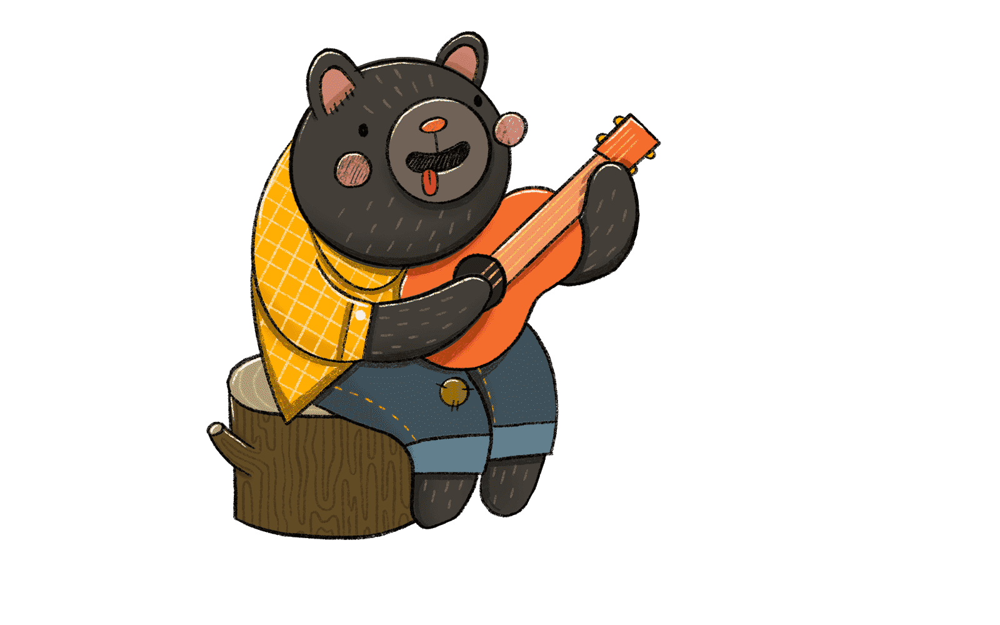

<h1 style="text-align: center;">Welcome to <strong>RossWebFS</strong> profile</h1>

🤩 Frontend Developer | 🚀 Lover of Modern Web Technologies

- ⭐ Trying to become best version of myself
- 🎯 Work on code and its impovements every day
- 💪 Learn modern web techonogies
- 📫 You can reach me: shimon.vip2006@gmail.com
---

### 💻Technology Stack:

---

### 📊 GitHub Stats:

  
  
  

 
 

